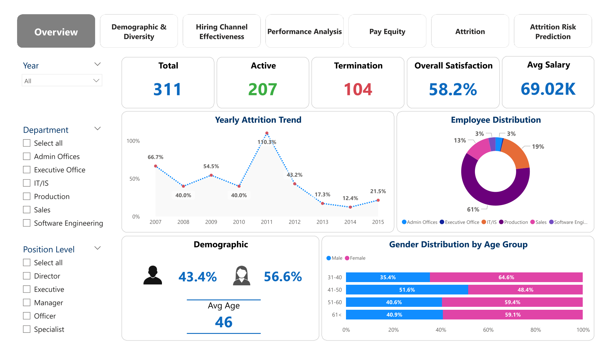

# 💼 Workforce Trends Dashboard: From Recruitment to Retention (Power BI)

## 📌 Portfolio Project Summary
This analytics dashboard using the HR dataset to uncover workforce trends across recruitment, performance, diversity, and attrition. Built in Power BI, it provides insights that help HR leaders make smarter decisions to improve employee retention and organizational equity.

---

## 🎯 Business Goal
> Understand which workforce trends impact employee retention, and how to take action to reduce turnover risk.

---

## 🛠️ Tools & Skills
- **Power BI**: Data modeling, DAX, interactive dashboards
- **HR Analytics**: Recruitment, performance, compensation, and attrition
- **Visualization**: Interactive charts, KPI cards, dynamic slicers
- **Storytelling**: Clear Layout with business context

---

## 📊 Key Insights
- **Production** and **Engineering** roles have the highest turnover.
- **Website** recruits retain the longest, while **Google Search** brings the most diverse hires.
- Short tenure, low performance, and specific job levels are tied to higher attrition risk.
- Pay equity remains balanced across genders with minor departmental gaps.

---

## 📷 Dashboard Preview
 

---

## 🔗 Dataset
- [HR Dataset on Kaggle](https://www.kaggle.com/datasets/rhuebner/human-resources-data-set)

---

## 🧠 What I Learned
- How to use multi-page dashboards for storytelling
- Importance of combining performance, diversity, and satisfaction data for holistic retention strategies
- Analyzing HR data through a data-driven business lens

---

## 🙋‍♀️ About Me
As a former HR professional now transitioning into data analytics, I'm passionate about turning complex data into clear, actionable insights.

---

## 📫 Let’s Connect
- **LinkedIn**: [It's me](https://www.linkedin.com/in/thiri-may-trm)

